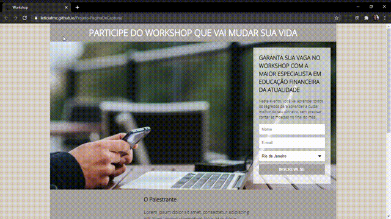
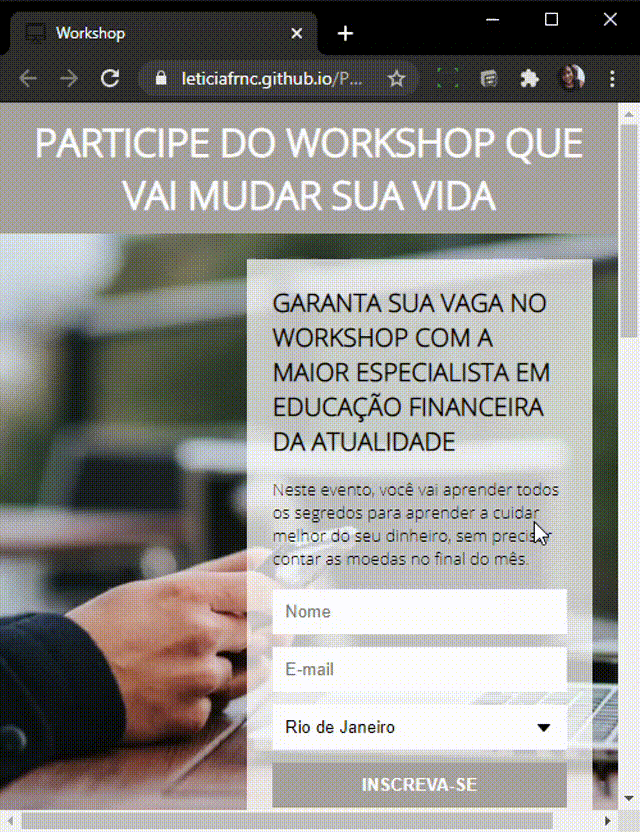

### O Projeto Workshop foi criado com objetivo de cadastrar pessoas para eventos. Utilizando a ferramenta online Mailchimp para ter acesso ao cadastro realizado pelos participantes.

### Características

- Css
- Html
- Mailchimp 

### Instalação 

Clone este repositório usando git clonehttps://github.com/Leticiafrnc/Projeto-PaginaDeCaptura.git ou clique em Code/Download ZIP.
Clique no arquivo "index.HTML" e veja a aplicação.

### Observação: Se abrir a aplicação no celular, tablet ou qualquer tipo de tela a aplicação se adapta.
